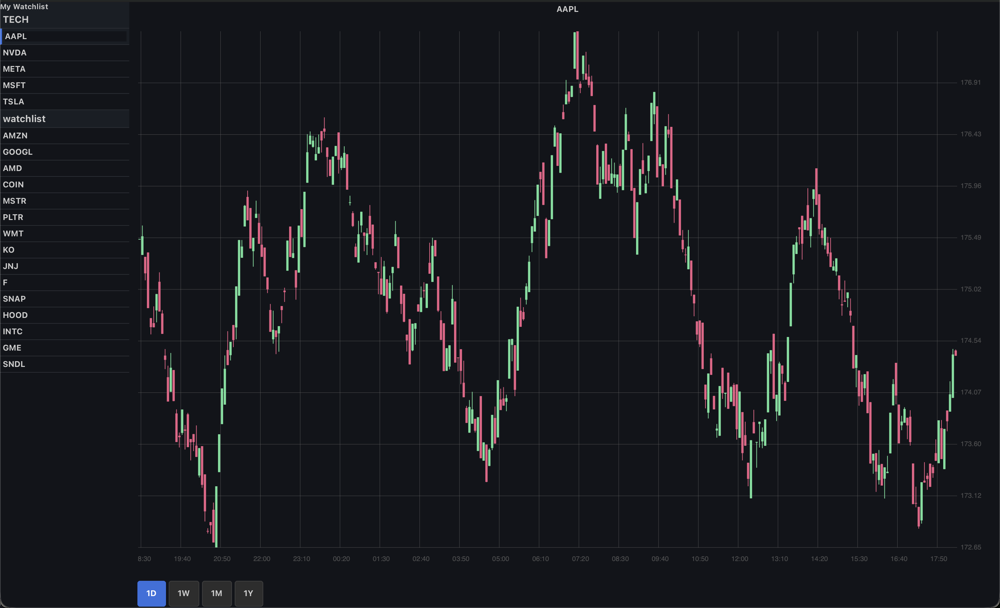

# Stock-Plots 📈

Ein in C entwickeltes Programm zur Visualisierung von Aktiendaten mit integriertem Hintergrunddienst (Daemon) für das automatisierte Logging. 

> **Hinweis:** Dieses Projekt habe ich im Rahmen meines Informatik-Studiums (3. Semester) entwickelt, um meine Kenntnisse in C, hardwarenaher Systemprogrammierung, API-Anbindungen und der GUI-Entwicklung mit GTK4 in der Praxis anzuwenden.

## 🖥️ Preview



## ✨ Features

* **Hintergrund-Daemon:** Lädt automatisch während der Börsenöffnungszeiten Aktiendaten über die Finnhub-API herunter und loggt sie lokal.
* **GTK4 GUI:** Visualisierung der gesammelten Daten als interaktive Candlestick-Charts (gezeichnet mit Cairo).
* **Portfolio-Management:** Organisation von Aktien in verschiedenen anpassbaren Kategorien/Watchlists.
* **Flexible Zeiträume:** Betrachtung der Charts in anpassbaren Intervallen (1D, 1W, 1M, 1Y) mit automatischem Resampling der Kerzen.
* **CLI-Steuerung:** Verwaltung von Aktien, Kategorien und API-Keys komfortabel direkt über Kommandozeilen-Parameter (`argp`).

## 🛠 Tech-Stack

* **Sprache:** C
* **GUI-Framework:** GTK4 & Cairo
* **Netzwerk:** `libcurl` (für REST-API Requests)
* **Datenverarbeitung:** `cJSON` (Parsing der API-Antworten und Config-Dateien)
* **Build-System:** GNU Autotools (Autoconf, Automake)

## 🚀 Build & Installation

Folgende Bibliotheken müssen auf dem System installiert sein:
* `gtk4` (und Entwickler-Header)
* `libcurl`

Das Projekt verwendet Autotools. Zum Kompilieren einfach folgende Befehle ausführen:

```bash
autoreconf -i
./configure
make
